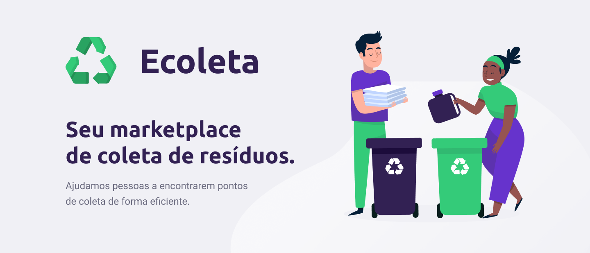

<h1 align="center">
    
</h1>


## 💻 Sobre o projeto

♻️ Ecoleta - é uma forma de conectar empresas e entidades de coleta de resíduos orgânicos e inorgânicos as pessoas que precisam descartar seus resíduos de maneira ecológica.

As empresas ou entidades poderão se cadastrar na plataforma web enviando:
- uma imagem do ponto de coleta
- nome da entidade, email e whatsapp
- e o endereço para que ele possa aparecer no mapa
- além de selecionar um ou mais ítens de coleta: 
  - lâmpadas
  - pilhas e baterias
  - papéis e papelão
  - resíduos eletrônicos
  - resíduos orgânicos
  - óleo de cozinha

Os usuários terão acesso ao aplicativo móvel, onde poderão:
- navegar pelo mapa para ver as instituições cadastradas
- entrar em contato com a entidade através do E-mail ou do WhatsApp

Projeto desenvolvido durante a **NLW - Next Level Week** oferecida pela [Rocketseat].
O NLW é uma experiência online com muito conteúdo prático, desafios e hacks onde o conteúdo fica disponível durante uma semana.


## 🎨 Layout

O layout da aplicação está disponível no Figma:

<a href="https://www.figma.com/file/9TlOcj6l7D05fZhU12xWT3/Ecoleta-(Booster)?node-id=56%3A801">
  
</a>


## 🛠 Tecnologias

As seguintes ferramentas foram usadas na construção do projeto:

- [Node.js] [https://nodejs.org/en/]
- [Express] [https://expressjs.com/pt-br/]
- [TypeScript] [https://www.typescriptlang.org/]
- [Postgres] [https://www.postgresql.org/]
- [TypeORM] [https://typeorm.io/#/]
- [Docker] [https://www.docker.com/]


## 🚀 Como executar o projeto

### Pré-requisitos

Antes de começar, você vai precisar ter instalado em sua máquina as seguintes ferramentas:
[Git](https://git-scm.com), [Node.js][nodejs], [docker](https://hub.docker.com/_/postgres). 
Além disto é bom ter um editor para trabalhar com o código como [VSCode][vscode]

```bash
# Após instalação do docker, você pode executar o comando abaixo, para criar uma imagem em seu container
# Antes de executar o comando, altere o NOME_PROJETO, deixando tudo em caixa baixa.
# Altere SENHA, para uma senha qualquer em caixa baixa.
# Por fim teremos a redirecionamento de portas. Caso ocorra um erro, basta alterar para oultra (Exemplo: 5440:5432). 
$ docker run --name NOME_PROJETO -e POSTGRES_PASSWORD=SENHA -p 5432:5432 -d postgres
```

### 🎲 Rodando o Back End (servidor)

```bash
# Clone este repositório
$ git clone https://github.com/FlankSilva/App-Ecoleta-api

# Instale as dependências
$ yarn

# Execute a aplicação em modo de desenvolvimento
$ yarn dev

# O servidor inciará na porta:3333 - acesse http://localhost:3333 
```

[nodejs]: https://nodejs.org/
[typescript]: https://www.typescriptlang.org/
[yarn]: https://yarnpkg.com/
[vscode]: https://code.visualstudio.com/
[prettier]: https://marketplace.visualstudio.com/items?itemName=esbenp.prettier-vscode